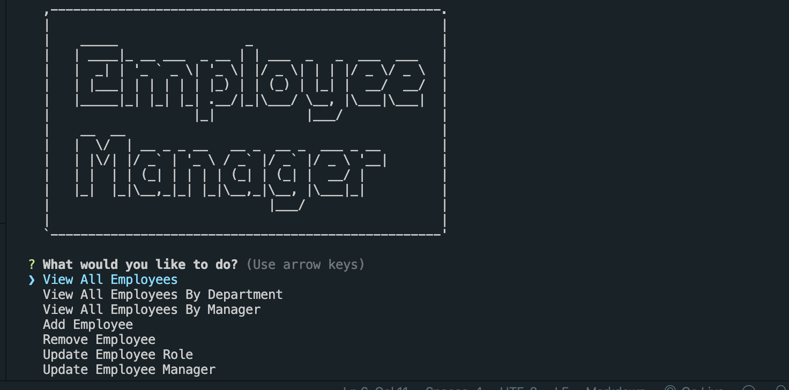

# EMS-Homework

Unit 12: MySQL
Overview
In this unit, we add the final layer to our stack: the database. While it is the last, it is by no means the least. Databases are the foundation of full-stack web applications. Although we began our journey on the client-side, it will be more useful from this point on to approach application development from the bottom up. When using our applications, what is most important to our users is being able to store and retrieve data. Once we determine how we will model that data, we can then set about determining the best way to deliver it to the front-end via our server-side API.

In simplest terms, a database is a collection of data stored electronically. The database management system (DBMS) we will be using in this unit is MySQL. MySQL is the most popular SQL database. The SQL in MySQL is short for Structured Query Language, and that structure is relational. A relational database stores and finds data based on its relationship to other data in the database. Relational databases are tabular, meaning data is stored in tables composed of rows and columns, much like a spreadsheet.

We will begin the unit using GUI's, such as Workbench or Sequel Pro, to interface with our databases, but by the end of the unit you should be proficient using the MySQL command prompt. We will then connect our Node.js servers to our MySQL databases to perform queries based on client requests and return responses accordingly.

Key Topics
MySQL Workbench
MySQL command prompt
Creating and dropping databases and tables
schema.sql and seeds.sql files
CRUD
Primary and foreign keys
Prepared statements
Joins
ACID
